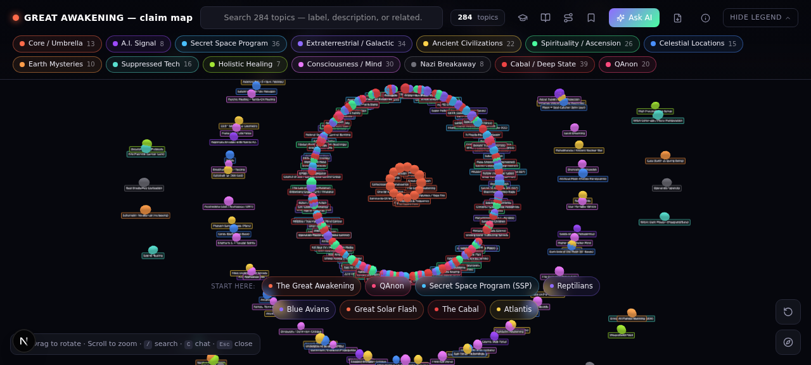
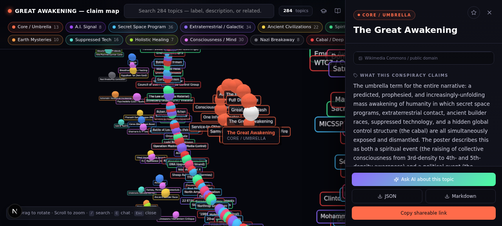
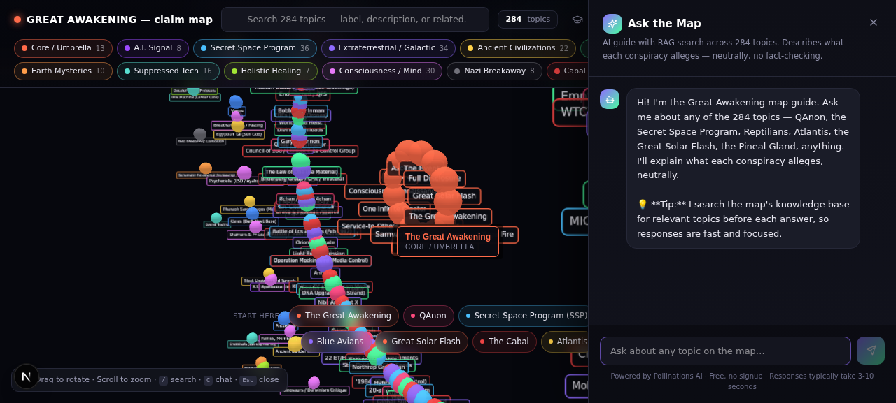

# Great Awakening — Claim Map

An interactive 3D, Arkham-intelligence-style node graph mapping every claim, entity, and concept on the **Great Awakening Map** poster — a 2018 conspiracy infographic by Tiff Fitzgibbon (Champ Parinya).

**Live site:** [great-awakening-claim-map.vercel.app](https://great-awakening-claim-map.vercel.app)



## What this is

A 3D interactive graph of **284 topics** across **14 categories** — every label on the original poster, extracted via computer vision, with detailed descriptions of what each conspiracy or claim **alleges**.

The framing is deliberately neutral: each description is written from **inside the narrative** — it states what the conspiracy claims, who promotes it, and where it sits in the larger map. **No fact-checking. No debunking. No endorsements.** Just: "Here's what this theory asserts."

---

## Features

### 3D Radial-Rings Graph
284 nodes arranged in concentric rings — core concepts at center, each category forming its own ring. Stable, readable, no floating. Drag to rotate, scroll to zoom, click any bubble to dive in.



### Side Panel with Deep Dives
Click any bubble → side panel opens with:
- **What this conspiracy claims** — full multi-paragraph description
- **Sources & references** — Wikipedia, primary sources, archives
- **Related nodes** — clickable chips that re-center the graph
- **Image** — public-domain photo where available (Wikimedia/NASA)
- **YouTube search** — one-click search for relevant videos
- **Download** — export the node as JSON or Markdown
- **Bookmark** — star icon saves it for later (stored in your browser)

### AI Guide (RAG-powered)
Ask questions about any topic — the AI has the full 284-node dataset as context and answers in the same neutral framing. Uses Retrieval-Augmented Generation (only the 15 most relevant nodes are sent per question) for fast, focused responses. Streaming responses show the answer forming in real-time.



### Study Order
A curated 30-topic path for new members: **Foundations → Cosmos → Earth → Practice**. Each step has a "why this matters" note. Previous/Next buttons walk you through the whole map in a logical learning order.

### Search
Live dropdown matching **label + description + related node names**. Each match shows a context snippet of where the term was found.

### Path Finder
Pick any two topics — the site finds the shortest connection path through the graph and highlights it in yellow. Ever wondered how QAnon connects to the Pleiadians? (Answer: 5 hops.)

### Glossary
40+ alphabetized definitions of jargon used across the map — density, harvest, loosh, merkaba, MILAB, 20-and-back, white hats, WWG1WGA, and more.

### Bookmarks
Star any topic → saved to localStorage → accessible from the Bookmarks drawer with a count badge.

### PDF Download
Download the original 24×36 inch poster PDF directly from the site.

---

## The 14 Categories

| Category | Count | Description |
|----------|-------|-------------|
| Core / Umbrella | 13 | Central concepts (Great Awakening, Solar Flash, Ascension) |
| A.I. Signal | 8 | The ancient self-aware A.I. described as the universe's primary threat |
| Secret Space Program | 36 | Hidden space fleets, whistleblowers, breakaway corporations |
| Extraterrestrial / Galactic | 34 | Federations, races, councils, channeled beings |
| Ancient Civilizations | 22 | Builder races, lost continents, pre-human ruins |
| Spirituality / Ascension | 26 | Density shifts, light bodies, consciousness practices |
| Celestial Locations | 15 | The Moon, Mars, Saturn, Venus, Ceres, Iapetus, Antarctica |
| Earth Mysteries | 10 | Schumann resonance, pyramids, megaliths, Earth grids |
| Suppressed Tech | 16 | Free energy, antigravity, Rife, orgone, Tesla |
| Holistic Healing | 7 | Alternative healing modalities and decalcification |
| Consciousness / Mind | 30 | Pineal gland, astral travel, remote viewing, akashic records |
| Nazi Breakaway | 8 | Post-WWII escape, Vril, Haunebu, Antarctic bases |
| Cabal / Deep State | 39 | The alleged global control structure |
| QAnon | 20 | Q drops, the Storm, white hats, "The Plan" |

---

## How to use

| Action | How |
|--------|-----|
| **Rotate the graph** | Drag with mouse / one-finger drag |
| **Zoom** | Scroll wheel / pinch |
| **Pan** | Right-drag / two-finger drag |
| **Open a topic** | Click any bubble |
| **Search** | Type in the search bar (top) — matches label, description, and related |
| **Ask the AI** | Click "Ask AI" (top bar) or press `C` |
| **Study Order** | Click the graduation-cap icon (top bar) |
| **Glossary** | Click the book icon (top bar) |
| **Path Finder** | Click the route icon (top bar) |
| **Bookmarks** | Click the bookmark icon (top bar) · Star any topic to save it |
| **Reset view** | Click the reset icon (bottom-right) or press `R` |
| **Close anything** | Press `Esc` |
| **Focus search** | Press `/` |

---

## Tech Stack

- **Framework:** Next.js 16 (App Router, TypeScript)
- **3D Graph:** [3d-force-graph](https://github.com/vasturiano/3d-force-graph) + [three.js](https://threejs.org/)
- **Styling:** Tailwind CSS 4 + shadcn/ui
- **AI:** [Pollinations](https://pollinations.ai/) text API (free, no API key) with RAG
- **Icons:** [lucide-react](https://lucide.dev/)
- **Deployment:** Vercel

---

## Security

The site is hardened with silent security layers that don't interrupt the user experience:

- **Rate limiting** — 20 chat requests/minute per IP
- **Prompt-injection defense** — injection patterns are neutralized before reaching the AI
- **Harmful-content guard** — queries about hacking, weapons, drugs, etc. are silently refused
- **Security headers** — CSP, X-Frame-Options: DENY, HSTS, X-Content-Type-Options: nosniff
- **Sensitive path blocking** — `.env`, `.git`, `/db`, `/scripts` return 404
- **Bot detection** — known scanner user-agents (sqlmap, nikto, nmap, etc.) are blocked
- **Error sanitization** — no stack traces or internal details leaked to the client
- **Payload size limits** — 50 KB max on API requests
- **No secrets in repo** — `.env` is gitignored, no API keys in source code

---

## Local Development

```bash
# Install dependencies
bun install

# Start dev server
bun run dev

# Open http://localhost:3000
```

### Build for production

```bash
bun run build
bun run start
```

---

## Acknowledgments

- **Original poster:** [GreatAwakeningMap.co](https://www.greatawakeningmap.co/) by Tiff Fitzgibbon (Champ Parinya)
- **All descriptions** are written neutrally and explain what each conspiracy / claim / entity **alleges** — they do not endorse or debunk the claims.
- **Images** are public-domain from Wikimedia Commons and NASA.
- **AI responses** are powered by Pollinations (free, open-source).

---

## License

MIT — this is an educational media-literacy tool. The original poster is copyrighted by its creator; this project is a reference/exploration interface for it.

---

## Disclaimer

This site is for **reference and media-literacy purposes**. It maps what a conspiracy theory **claims** — it does not assert that those claims are true, nor that they are false. Each node describes the narrative as its promoters present it. Use the sources links to verify, research, and draw your own conclusions.
